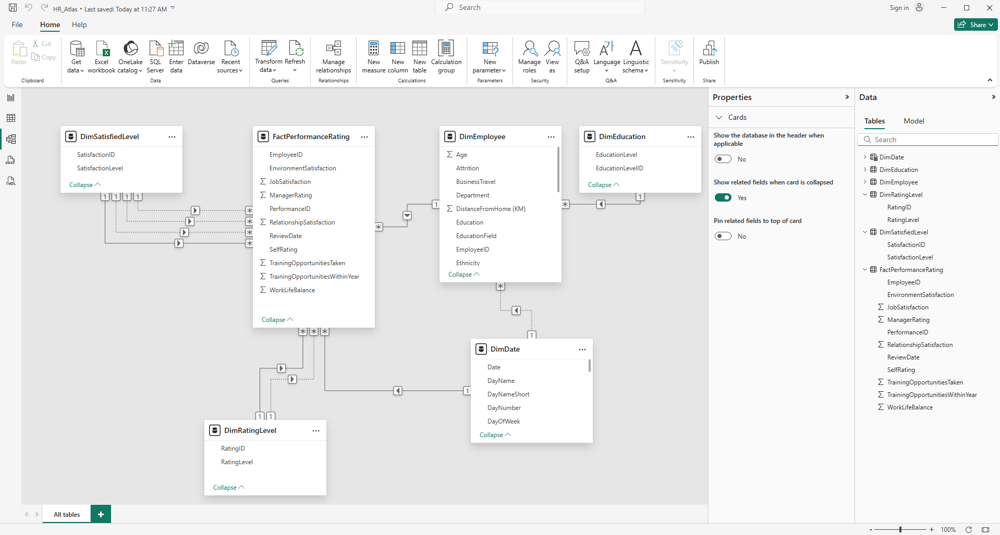
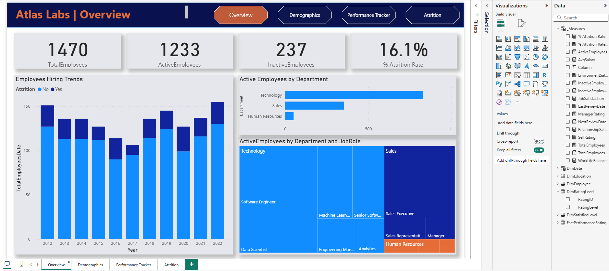
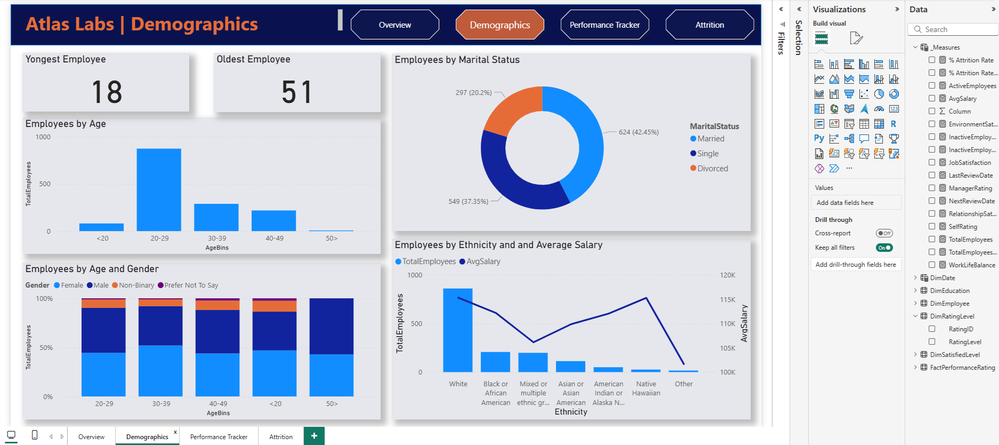
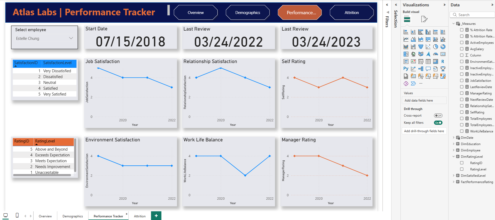
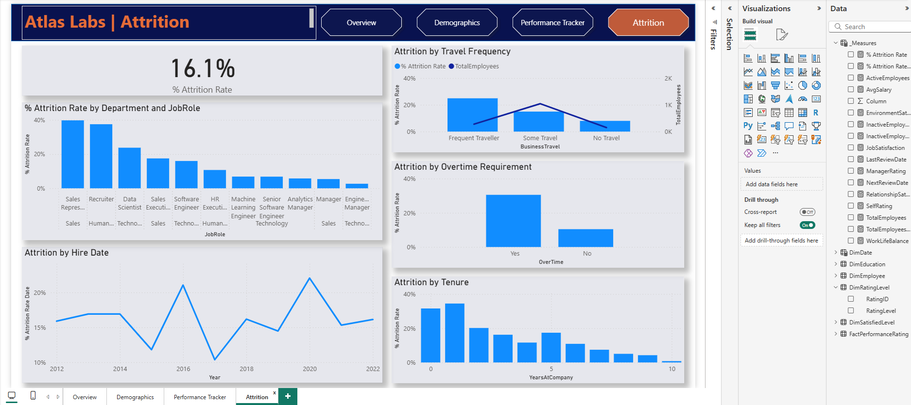

# HR Analytics — Atlas Labs

In this Power BI case study, I built an end-to-end **HR Analytics report** for a fictitious technology company, **Atlas Labs**.  
The goal of this project was to **monitor key employee metrics** and **understand what factors impact employee attrition**.

This case study demonstrates skills in **data modeling, DAX calculations, and Power BI storytelling** — creating a fully interactive HR dashboard that provides actionable insights into workforce trends, diversity, and performance.

---

## Project Overview

The core goal of this case study is to design and develop a Power BI solution that allows Atlas Labs’ HR leadership team to:

- Track key HR performance metrics  
- Explore hiring trends and workforce demographics  
- Understand **employee attrition drivers**  
- Evaluate **employee satisfaction and performance** over time  

The final data model follows a **snowflake schema** built using the **Kimball methodology**.  
I work with **one fact table** and **five dimension tables** — with one dimension indirectly related to the fact.

---

## Data Model Design

### Fact Table: `FactPerformanceRating`

This table stores yearly employee review data and acts as the center of the model.

| Column | Description |
|--------|--------------|
| PerformanceID | Unique identifier for each performance review |
| EmployeeID | Employee identifier (linked to `DimEmployee`) |
| ReviewDate | Date of performance review |
| EnvironmentSatisfaction | Satisfaction with work environment |
| JobSatisfaction | Satisfaction with job role |
| RelationshipSatisfaction | Satisfaction with relationships |
| WorkLifeBalance | Satisfaction with work–life balance |
| SelfRating | Employee self-assessment |
| ManagerRating | Manager’s evaluation |
| TrainingOpportunitiesWithinYear | Trainings offered |
| TrainingOpportunitiesTaken | Trainings completed |

---

### Dimension Tables

#### `DimEmployee`
Contains employee demographic and job-related data.

#### `DimEducationLevel`
Defines employee education levels (Doctorate, Masters, etc.), connected to `DimEmployee`.

#### `DimRatingLevel`
Defines rating meanings (Exceeds Expectation, Meets Expectation, etc.), linked to self and manager ratings.

#### `DimSatisfiedLevel`
Defines satisfaction levels (Very Satisfied → Very Dissatisfied), connected to satisfaction measures in the fact table.

#### `DimDate`
Custom date table created in Power BI for time-based analysis (Year, Quarter, Month, Day).

---

##  Data Preparation and Modeling Steps

1. **Loaded and renamed datasets** (Performance, Employee, EducationLevel, RatingLevel, SatisfiedLevel).  
2. **Created and connected a Date table** → linked to `FactPerformanceRating[ReviewDate]`.  
3. **Connected** `DimEducationLevel` → `DimEmployee` using `EducationLevelID`.  
4. Verified and adjusted **data types** in Power BI.  
5. Built the **snowflake schema model**.

---

## Report Development Process

### Overview Page

The leadership team at Atlas Labs needed visibility on high-level employee metrics — particularly around **attrition**.

#### Created a `_Measures` Table:
- `TotalEmployees`
- `ActiveEmployees`
- `InactiveEmployees`
- `% Attrition Rate`
- `TotalEmployeesDate` 

#### Visuals:
- **Card**: TotalEmployees
- **Card**: ActiveEmployees
- **Card**: InactiveEmployees
- **Card**: % Attrition Rate

Explored how workforce distribution and activity vary across departments:

- **Stacked Column Chart**: Employees Hiring Trends
- **Clustered Bar Chart** → ActiveEmployees by Department 
- **Treemap** → ActiveEmployees by Department and Job Role 

**Insights**
- Atlas Labs has hired **1,470 employees** since inception, with **1,233 currently active**.  
- The **Technology department** is the largest, as expected for a software company.  

---

### Demographics Page 

This page explores workforce diversity and inclusion — focusing on **age, gender, marital status, and ethnicity**.

#### Section 1: Age & Gender
- Added **cards**: “Youngest Employee” and “Oldest Employee”  
- Created `AgeBins` column: `<20`, `20–29`, `30–39`, `40–49`, `50+`  
- **Stacked Column Chart**: TotalEmployees by AgeBins  
- **Stacked Chart**: TotalEmployees by AgeBins and Gender   

#### Section 2: Marital Status & Ethnicity
- **Donut Chart**: Employees by MaritalStatus  
- Added measure: `AverageSalary`  
- **Line & Stacked Column Chart**: Employee Count and AverageSalary by Ethnicity  

**Insights**
- The majority of employees are aged **20–29 years**.  
- Gender distribution: **46% Female**, **44% Male**, **8.5% Non-Binary**.  
- **White** employees have the highest average salary, while **mixed-ethnicity** employees earn less on average.  

These insights help Atlas Labs evaluate its **diversity, inclusion, and pay equity** strategies.

---

### Performance Tracker Page

This page allows HR to review **employee performance and satisfaction trends**.

#### Steps:
- Added a calculated column in `DimEmployee` → `FullName = [FirstName] & " " & [LastName]`  
- Added slicer by `FullName` to filter reports  
- Created cards:
  - “Start Date”  
  - “Next Review”  

#### Measures:
- `LastReviewDate`
- `NextReviewDate`

Dived deeper into **individual review ratings:**

#### Measures:
- `JobSatisfaction`
- `EnvironmentSatisfaction`
- `RelationshipSatisfaction`
- `WorkLifeBalance`
- `SelfRating`
- `ManagerRating`

#### Visuals:
- **Line Charts** for:
  - EnvironmentSatisfaction, JobSatisfaction, WorkLifeBalance, RelationshipSatisfaction (by Year)
  - SelfRating vs. ManagerRating (by Year)

---

### Attrition Page

This page investigates **why employees leave** and **which groups are most at risk**.

#### Steps:
- Added **Card**: % Attrition Rate  
- **Stacked Column Chart**: % Attrition Rate by Department and Job Role  

#### Additional Measures:
- `InactiveEmployeesDate`
- `% Attrition Rate Date`

#### Visuals:
- **Line Chart**: Attrition by Hire Date 
- **Line and Stacked Column Chart**: Attrition by Travel Frequency 
- **Stacked Column Chart**: Attrition by Overtime (Yes/No)  
- **Stacked Column Chart**: Attrition by Tenure

###  Analysis

Attrition at Atlas Labs stands at **16.1% overall**, but the rate varies significantly by department, job role, and work conditions.

| Department / Role | Attrition Rate (%) | Key Insight |
|--------------------|-------------------|--------------|
| Human Resources Recruiter | **37.5%** | High turnover, potentially linked to role stress and recruitment pressures |
| Sales Representative | **39.8%** | Highest attrition rate, possibly driven by sales targets and competition |
| Data Scientist | **23.9%** | Moderate attrition, may reflect market demand and job mobility |
| Frequent Travelers | **25.0%** | Despite being only 19% of total hires, they show higher turnover |
| Travelers with Overtime | **30.5%** | Highest attrition segment — workload and burnout concerns |
| Early Tenure Employees | **>30%** | Most attrition occurs **within the first years** of employment |

These findings suggest that **workload intensity**, **travel frequency**, and **role stress** are major attrition drivers for Atlas Labs.  
Sales and HR positions, in particular, face retention challenges that warrant immediate review.

**Recommendations:**
- Reassess **travel requirement policies** and conduct surveys on employee perceptions of travel workload.  
- Review **incentives and workload balance** in Sales and HR departments.  
- Strengthen **onboarding and early engagement programs** to reduce first-year attrition.  
- Continue tracking attrition by tenure and job type for ongoing insights.

 

##  Learnings & Reflections

This project strengthened my ability to:

- Build a complete **Power BI solution** from scratch  
- Design a **snowflake schema** and connect multiple dimension tables  
- Use **DAX and CALCULATE() with USERELATIONSHIP()** for time-aware measures  
- Communicate HR insights effectively through **interactive dashboards**  
- Translate workforce data into **strategic business insights**  

---

## 🧾 Final Dashboard

The **Atlas Labs HR Analytics Dashboard** consolidates all findings into one interactive Power BI report.  
It empowers HR leaders to **track performance**, **analyze attrition**, and **promote data-driven talent management**.

---

## 🧰 Tools Used

**Power BI | Power Query | DAX | Data Modeling | Data Storytelling**

